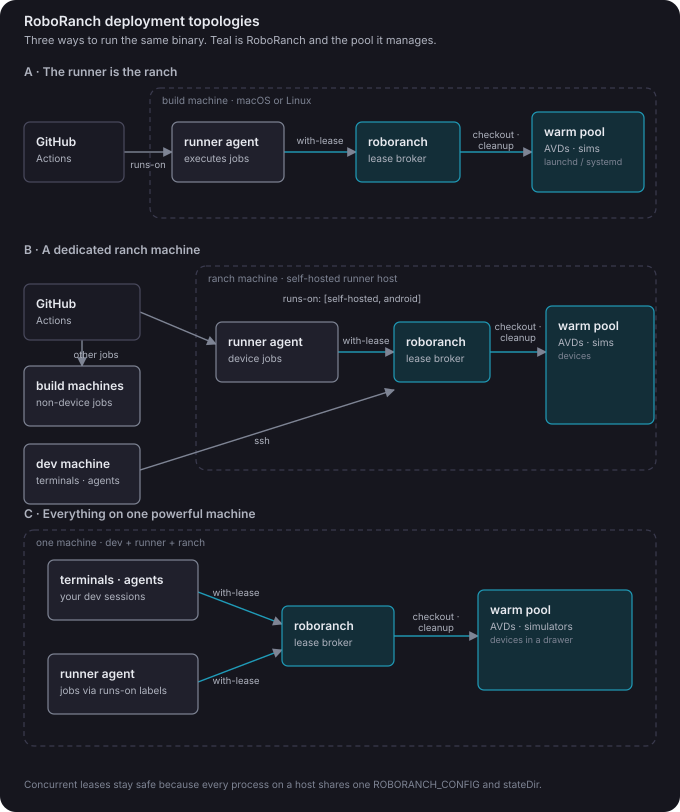

# RoboRanch

<p align="center">
  
</p>

RoboRanch is a lightweight Android and iOS target lease broker for local developers, agentic coding sessions, and CI runners.

It is smaller than Appium Grid, Selenium Grid, or a device cloud. Those tools route test protocols. RoboRanch manages the host-level pool underneath. It tracks which target is free, how long a job may hold it, whether it is healthy, and how to clean it before the next job.

## Supported Targets

| Platform | Config `type` | Host tooling | Health and release behavior |
| --- | --- | --- | --- |
| Android emulator | `emulator` | `adb`, Android Emulator | Repairs unhealthy AVDs and removes third-party apps on release by default |
| Android device | `device` | `adb` | Health-checks attached hardware; cleanup is opt-in |
| iOS simulator | `simulator` | macOS, Xcode, `simctl` | Boots shutdown simulators, then erases and warm-boots them on release |
| Physical iPhone | `device` | macOS, Xcode, `devicectl` | Requires a paired, connected, unlocked Developer Mode device; never mutates it |

iOS support is macOS-only. Existing configurations remain Android-compatible because a missing `platform` field means `android`, and checkout defaults to `--platform android`.

## What It Does

RoboRanch gives multiple local terminals, coding agents, build scripts, and CI jobs a shared way to lease Android and iOS targets:

```sh
roboranch with-lease --type emulator --label api36 --wait 20m -- ./gradlew connectedDebugAndroidTest
```

For an iOS simulator:

```sh
roboranch with-lease --platform ios --type simulator --label ios26 --wait 20m -- \
  sh -c 'xcodebuild test -scheme MyApp -destination "$ROBORANCH_XCODE_DESTINATION"'
```

While the command runs, RoboRanch always exports:

- `ROBORANCH_DEVICE_ID`
- `ROBORANCH_LEASE_ID`
- `ROBORANCH_PLATFORM`
- `ROBORANCH_DEVICE_TYPE`
- `ROBORANCH_TARGET_ID`

Android leases also export `ANDROID_SERIAL`. iOS leases export `ROBORANCH_IOS_UDID` and `ROBORANCH_XCODE_DESTINATION`.

When the command exits, RoboRanch applies the target's cleanup policy and releases the lease. iOS simulators are erased and returned warm; physical iPhones are never mutated.

## Install

Install with Homebrew:

```sh
brew install KalebKE/tap/roboranch
```

Or tap first:

```sh
brew tap KalebKE/tap
brew install roboranch
```

Install a release binary directly from [GitHub Releases](https://github.com/KalebKE/RoboRanch/releases):

```sh
curl -L -o roboranch.tar.gz https://github.com/KalebKE/RoboRanch/releases/download/v0.2.0/roboranch_v0.2.0_darwin_arm64.tar.gz
tar -xzf roboranch.tar.gz
sudo mv roboranch /usr/local/bin/
```

Or install from source:

```sh
go install github.com/KalebKE/RoboRanch/cmd/roboranch@latest
```

For local development on RoboRanch itself:

```sh
git clone https://github.com/KalebKE/RoboRanch.git
cd RoboRanch
go test ./...
go build -o bin/roboranch ./cmd/roboranch
```

If you built locally, either add `./bin` to `PATH` or run `./bin/roboranch`.

## Agent Setup

This setup is meant to be done by a coding agent. Paste this prompt into
Claude Code or Codex running on the host you want to serve targets from and
review what it reports back:

```text
Set up RoboRanch on this machine so builds and coding agents can lease
Android emulators (and iOS simulators if this is a Mac with Xcode).

Done means `roboranch with-lease --type emulator --label <api-label> --wait 20m -- <cmd>`
works from a fresh shell, and two concurrent leases receive two different targets.

Work from the README at https://github.com/KalebKE/RoboRanch and `roboranch --help`:

1. Install roboranch (Homebrew tap KalebKE/tap, or go install).
2. Inventory the host's real targets: `adb devices`, `emulator -list-avds`,
   and on macOS `xcrun simctl list devices available`. Never invent serials
   or UDIDs; the pool describes what exists on the host.
3. Write ~/.config/roboranch/pool.json for those targets, with labels that
   match API level or OS version (api36, ios26). Physical devices keep
   cleanup disabled.
4. If this host should keep emulators warm between jobs, install the launchd
   (macOS) or systemd (Linux) unit from the README's warm-pool section.
5. Verify with observable state: `roboranch list` shows the pool, two
   concurrent with-lease runs export different ROBORANCH_DEVICE_ID values,
   and the target is healthy again after release.

Constraints: do not modify AVDs or simulators beyond what roboranch's own
cleanup policy does. Never mutate a physical device. Ask before installing
system daemons. Finish with a short summary of what was installed, the pool
you wrote, and the verification output.
```

On a host with unusual tooling paths, hand the agent the failing command
output and let it adjust the pool config rather than editing by hand.

## Prerequisites

Every host needs a shared RoboRanch config and state directory. Platform tooling depends on the targets it serves:

- Android: SDK platform tools (`adb`) and a bootable AVD or attached Android device.
- iOS: macOS with Xcode and `xcrun simctl`.
- Physical iPhone: `xcrun devicectl`, a paired and unlocked phone, Developer Mode enabled, and developer services connected.

RoboRanch discovers the Android SDK from:

1. `ANDROID_HOME`
2. `ANDROID_SDK_ROOT`
3. common platform defaults, such as `~/Library/Android/sdk` on macOS and `~/Android/Sdk` on Linux

You can also set `androidSdk` directly in the config.

## Configuration

Create the default config:

```sh
roboranch init
```

By default this writes:

```text
~/.config/roboranch/pool.json
```

Override the config path with either:

```sh
roboranch --config ./pool.json list
```

or:

```sh
export ROBORANCH_CONFIG="$PWD/pool.json"
```

A complete sanitized example is in [examples/pool.example.json](examples/pool.example.json).

### Minimal Config

```json
{
  "version": 1,
  "stateDir": "~/.local/share/roboranch",
  "androidSdk": "",
  "defaultTTL": "30m",
  "repairTimeout": "2m",
  "devices": [
    {
      "id": "api36-1",
      "type": "emulator",
      "serial": "emulator-5554",
      "labels": ["emulator", "api36", "x86_64"]
    },
    {
      "id": "usb-1",
      "type": "device",
      "serial": "REPLACE_WITH_ADB_SERIAL",
      "labels": ["device", "physical"],
      "cleanup": {"enabled": false}
    },
    {
      "id": "ios-sim-1",
      "platform": "ios",
      "type": "simulator",
      "serial": "REPLACE_WITH_SIMULATOR_UDID",
      "labels": ["simulator", "ios26", "iphone"]
    }
  ]
}
```

The important fields are:

- `stateDir`: shared lock, lease, and log directory for this host.
- `androidSdk`: optional SDK path. Leave empty to use environment/default discovery.
- `defaultTTL`: default lease lifetime. Expired leases are reaped by `gc` and before checkout.
- `repairTimeout`: how long virtual-target repair and cleanup wait for boot.
- `devices[].id`: stable RoboRanch id used for leases.
- `devices[].platform`: `android` or `ios`; omitted means `android` for compatibility.
- `devices[].type`: `emulator`, `simulator`, or `device`, as appropriate for the platform.
- `devices[].serial`: ADB serial for Android or UDID for iOS.
- `devices[].labels`: selectors used by jobs, such as `api36`, `x86_64`, `pixel`, or `physical`.
- `devices[].cleanup.enabled`: virtual-target cleanup is enabled by default; physical-device cleanup is disabled. Physical iPhone cleanup cannot be enabled.
- `devices[].launchdLabel`: macOS service name used by `repair`.
- `devices[].systemdUnit`: Linux user service name used by `repair`.

Check the config and host:

```sh
roboranch doctor
roboranch list
roboranch list --json
```

## Android Local Development Setup

Use this mode when a developer machine has one or more already-running emulators or USB devices.

1. Start an emulator with Android Studio, `emulator`, or your usual Android tooling.

2. Find its serial:

```sh
adb devices
```

3. Put that serial in `~/.config/roboranch/pool.json`.

4. Verify RoboRanch can see it:

```sh
roboranch list
```

5. Run local tests through a lease:

```sh
roboranch with-lease --type emulator --wait 5m -- ./gradlew connectedDebugAndroidTest
```

For multiple concurrent coding agents or terminals, make sure they all use the same `ROBORANCH_CONFIG` and `stateDir`. They can then share the pool without colliding:

```sh
export ROBORANCH_CONFIG="$HOME/.config/roboranch/pool.json"
roboranch with-lease --label api36 --wait 20m -- ./gradlew connectedDebugAndroidTest
```

Manual checkout and release are also supported:

```sh
lease_info=$(roboranch checkout --type emulator --label api36 --wait 10m)
lease=$(printf '%s' "$lease_info" | awk '{print $1}')
serial=$(printf '%s' "$lease_info" | awk '{print $2}')
id=$(printf '%s' "$lease_info" | awk '{print $3}')

ANDROID_SERIAL="$serial" ./gradlew connectedDebugAndroidTest
roboranch release --id "$id" --lease "$lease"
```

Prefer `with-lease` for normal use because it releases automatically.

## iOS Setup

iOS targets require macOS and Xcode. RoboRanch manages fixed, pre-created simulator UDIDs; it does not dynamically create or clone simulators.

List available simulator UDIDs:

```sh
xcrun simctl list devices available
```

Add one to the pool and verify it:

```json
{
  "id": "ios-sim-1",
  "platform": "ios",
  "type": "simulator",
  "serial": "REPLACE_WITH_SIMULATOR_UDID",
  "labels": ["simulator", "ios26", "iphone", "pool-1"]
}
```

```sh
roboranch doctor
roboranch list
roboranch with-lease --platform ios --type simulator --label ios26 --wait 5m -- \
  sh -c 'xcrun simctl bootstatus "$ROBORANCH_IOS_UDID"'
```

Physical iPhones use `type: "device"`. They are leasable only while paired, connected to developer services, unlocked, and in Developer Mode. RoboRanch never pairs, unlocks, repairs, erases, or uninstalls apps from them.

```sh
roboranch with-lease --platform ios --type device --wait 10m -- \
  sh -c 'xcodebuild test -scheme MyApp -destination "$ROBORANCH_XCODE_DESTINATION"'
```

See [docs/quickstart-ios.md](docs/quickstart-ios.md) for complete simulator-pool, physical-device, and `xcodebuild` examples.

## Warm Local Android Emulator Pool

For faster repeated tests, keep emulators running from a clean snapshot and let RoboRanch lease them.

The recommended pool shape is:

- one AVD per slot
- one fixed port per AVD
- one clean snapshot named `ci-clean`
- one launchd or systemd service per AVD
- one matching device entry in `pool.json`

Example serial mapping:

```text
pool-1 -> emulator-5554
pool-2 -> emulator-5556
pool-3 -> emulator-5558
pool-4 -> emulator-5560
```

### macOS launchd

Use [templates/launchd/com.roboranch.pool-N.plist.tmpl](templates/launchd/com.roboranch.pool-N.plist.tmpl).

Replace these placeholders:

- `{{N}}`
- `{{ANDROID_SDK}}`
- `{{PORT}}`
- `{{AVD_NAME}}`
- `{{STATE_DIR}}`
- `{{HOME}}`

Install and start:

```sh
mkdir -p "$HOME/Library/LaunchAgents"
cp com.roboranch.pool-1.plist "$HOME/Library/LaunchAgents/"
launchctl bootstrap "gui/$(id -u)" "$HOME/Library/LaunchAgents/com.roboranch.pool-1.plist"
launchctl kickstart -k "gui/$(id -u)/com.roboranch.pool-1"
```

Configure the matching device with `launchdLabel`:

```json
{
  "id": "pool-1",
  "type": "emulator",
  "serial": "emulator-5554",
  "launchdLabel": "com.roboranch.pool-1",
  "labels": ["emulator", "api36", "x86_64"]
}
```

### Linux systemd

Use [templates/systemd/roboranch-pool-N.service.tmpl](templates/systemd/roboranch-pool-N.service.tmpl).

Replace these placeholders:

- `{{N}}`
- `{{ANDROID_SDK}}`
- `{{PORT}}`
- `{{AVD_NAME}}`
- `{{STATE_DIR}}`

Install and start:

```sh
mkdir -p "$HOME/.config/systemd/user"
cp roboranch-pool-1.service "$HOME/.config/systemd/user/"
systemctl --user daemon-reload
systemctl --user enable --now roboranch-pool-1.service
```

Configure the matching device with `systemdUnit`:

```json
{
  "id": "pool-1",
  "type": "emulator",
  "serial": "emulator-5554",
  "systemdUnit": "roboranch-pool-1.service",
  "labels": ["emulator", "api36", "x86_64"]
}
```

## Deployment Topologies

<p align="center">
  
</p>

The same binary supports three shapes:

- **The runner is the ranch.** A build machine runs the GitHub runner agent, `roboranch`, and the warm pool together. Jobs land via `runs-on` labels and lease locally. This is the simplest setup and the one most of this README assumes.
- **A dedicated ranch machine.** One machine holds the pool and also runs a runner agent. Device jobs route to it with `runs-on: [self-hosted, android]` while other build machines take non-device jobs, and dev machines reach the same pool over ssh. RoboRanch has no network server; co-locating a runner agent on the ranch is what makes remote jobs work.
- **Everything on one powerful machine.** Dev terminals, coding agents, the runner agent, and the pool share one host. Concurrent leases stay safe because every process shares the same `ROBORANCH_CONFIG` and `stateDir`.

## Remote Runner Setup

RoboRanch is most useful on self-hosted runners because virtual-device pools can stay warm across jobs. It can also wrap a single target on an ephemeral hosted runner, but hosted runners do not get the same warm-pool benefit.

### Self-hosted Android Runner

On the runner host:

1. Install Android SDK, platform tools, emulator, and system images.
2. Create AVDs and save clean snapshots.
3. Install launchd agents on macOS or systemd user services on Linux.
4. Install `roboranch`.
5. Create a shared config, for example `/opt/roboranch/pool.json` or `$HOME/.config/roboranch/pool.json`.
6. Use a persistent `stateDir`, for example `/opt/roboranch/state` or `$HOME/.local/share/roboranch`.
7. Export `ROBORANCH_CONFIG` in the runner service environment.

Example workflow:

```yaml
name: Android Instrumented Tests

on:
  pull_request:

jobs:
  connected-tests:
    runs-on: [self-hosted, macOS, android]
    steps:
      - uses: actions/checkout@v4
      - name: Check RoboRanch
        run: roboranch list
      - name: Run connected tests
        run: roboranch with-lease --type emulator --label api36 --wait 20m -- ./gradlew connectedDebugAndroidTest
```

For Linux self-hosted runners, use runner labels that match your fleet:

```yaml
runs-on: [self-hosted, Linux, android]
```

The important part is that all concurrent jobs on the same runner host share the same `ROBORANCH_CONFIG` and `stateDir`.

### Self-hosted iOS Runner

For iOS, use a self-hosted macOS runner with pre-created simulator UDIDs:

```yaml
- name: Run iOS tests
  run: |
    roboranch with-lease --platform ios --type simulator --label ios26 --wait 20m -- \
      sh -c 'xcodebuild test -scheme MyApp -destination "$ROBORANCH_XCODE_DESTINATION"'
```

### GitHub-hosted Android Runner

Use this mode when the workflow creates and boots one emulator inside the job. RoboRanch will still provide consistent lease and cleanup behavior, but it will not provide a pre-warmed pool across jobs.

Example job-local config:

```yaml
- name: Write RoboRanch config
  run: |
    mkdir -p "$RUNNER_TEMP/roboranch"
    cat > "$RUNNER_TEMP/roboranch/pool.json" <<JSON
    {
      "version": 1,
      "stateDir": "$RUNNER_TEMP/roboranch/state",
      "defaultTTL": "30m",
      "devices": [
        {
          "id": "hosted-emulator",
          "type": "emulator",
          "serial": "emulator-5554",
          "labels": ["emulator", "hosted"]
        }
      ]
    }
    JSON
    echo "ROBORANCH_CONFIG=$RUNNER_TEMP/roboranch/pool.json" >> "$GITHUB_ENV"
```

After your workflow boots the emulator:

```yaml
- name: Run connected tests
  run: roboranch with-lease --type emulator --wait 5m -- ./gradlew connectedDebugAndroidTest
```

If your emulator serial differs, generate the config after `adb devices` reports the emulator.

## Cleanup Policy

Android emulators are cleaned by default on release:

- uninstall third-party packages
- force-stop packages before uninstall
- run `am kill-all`
- run `sync`
- clear logcat
- reset animation scales to `0.0`

RoboRanch does not call `pm trim-caches`; that command caused follow-on instrumentation installs to fail in the source pool.

Physical devices are not cleaned by default. Enable cleanup per physical device only when that is acceptable for that hardware:

```json
{
  "id": "physical-1",
  "type": "device",
  "serial": "REPLACE_WITH_ADB_SERIAL",
  "cleanup": {"enabled": true}
}
```

iOS simulators are cleaned strictly. RoboRanch shuts them down, erases their contents and settings, boots them again, and waits for boot completion before releasing the lock. If erase or warm boot fails, the lease remains locked for `release` or `gc` to retry.

Physical iPhone cleanup is unsupported. Config validation rejects `cleanup.enabled: true` for an iOS `device`.

## Command Reference

```text
roboranch init [--force]
roboranch doctor
roboranch list [--json]
roboranch status --id ID [--json]
roboranch checkout [--platform android|ios|any] [--type emulator|simulator|device|any] [--label LABEL] [--serial SERIAL_OR_UDID] [--ttl DURATION] [--wait DURATION] [--json]
roboranch release --id ID [--lease LEASE]
roboranch with-lease [checkout selectors] -- CMD [ARGS...]
roboranch repair --id ID|--all
roboranch gc [--verbose]
```

The exit codes are:

- `0`: success
- `1`: matching devices are currently unavailable
- `2`: bad arguments or no selector match
- `3`: matching devices are unhealthy

## Development

Run the checks:

```sh
go test ./...
go vet ./...
```

Build local release targets:

```sh
GOOS=darwin GOARCH=arm64 go build -o dist/roboranch-darwin-arm64 ./cmd/roboranch
GOOS=linux GOARCH=amd64 go build -o dist/roboranch-linux-amd64 ./cmd/roboranch
```
